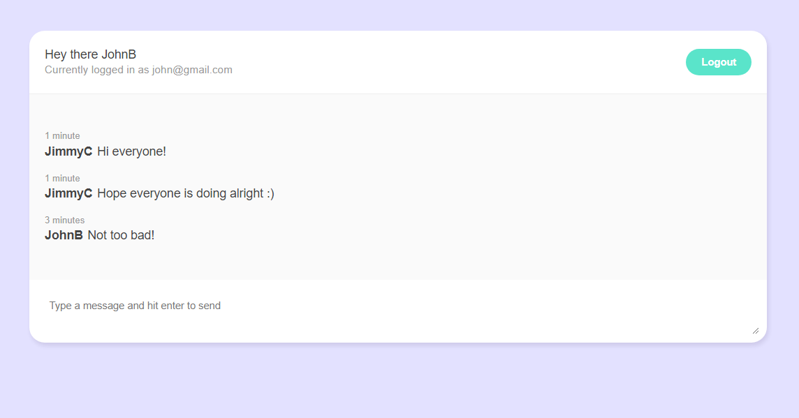

# Simple Chatroom

<!--TABLE OF CONTENTS-->
<ol>
  <li><a href="#about-the-project">About The Project</a></li>
  <li><a href="#getting-started">Getting Started</a></li>
    <ul>
      <li><a href="#dependencies">Dependencies</a></li>
      <li><a href="#installation">Installation</a></li>
    </ul>
</ol>

<!-- ABOUT THE PROJECT -->
## About The Project
Chat room made using the Vue composition API. The application uses firebase authentication and cloud storage.



## Getting Started

<a href="https://vuejs.org/"><b>Vue.js</b></a> is required to run this program.

### Dependencies

npm
```sh
npm install -g npm
```
date-fns
```sh
npm install date-fns
```
firebase
```sh
npm install firebase
```

### Installation

Compiles and hot-reloads for development
```sh
npm run serve
```

  


